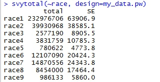

### Reading in foreign file formats

We downloaded the iPUMS data in Stata format. Stata, like SAS or SPSS, are costly statistical packages. R can't natively import these file formats, so we need to use a package to read them. I use [Haven](https://cran.r-project.org/web/packages/haven/haven.pdf). 

Let's install Haven. 

```R
install.packages("haven")
```

Now let's set our working directory 

```R
setwd("D:/newdata2/survey")
```

And before you can actually use a package like Haven, you have to tell R to load it. Let's do that. 

```R
library(haven)
```

OK, now we're ready to load our data. We're going to load the data and assign it to the my_data object. 

```R
my_data <- read_dta("usa_00022.dta")
```

The most important thing about dealing with survey data like the ACS or CPS is the use of a weight variable. Each record is weighted. For example, your first record might have a weight of 1.76. That means it is not counted one time, but rather 1.76 times. Doing these calculations in SQL could be a pain, but it's quite a bit easier with a statistical package like R. 

But to do this, let's install another R package: [Survey](https://cran.r-project.org/web/packages/survey/survey.pdf).

```R
install.packages("survey")
```

And just like with Haven, we need to tell R to use it. 

```R
library("survey")
```

Now we need to tell R's Survey package how our data is set up. You'll see in the ACS data that there's a field for household weights and another for people. So if we're counting household-level things, we want to use the household weight (hhwt). If you're counting people-level things, you want to use the person weight (perwt). 

Let's keep things simple. The code below will create an object that holds the survey design information. 

```R
my_data.pw <- svydesign(ids=~0, weights=~perwt, data=my_data)
```

The ids variable specifies the cluster ids. You can use ~0 or ~1 for no clusters. As you can see, we used the perwt for weights because we want to analyze people-level things. If you plan to analyze both levels, you might want to create another svydesign object. This time just change the name of the object (I used .hw for household weight). 

```R
my_data.hw <- svydesign(ids=~0, weights=~hhwt, data=my_data)
```

OK. Now let's start analyzing the data. The first thing I always like to do is take a top-level look at my data to make sure I've got the data imported with all the records. The way I do it is by getting a sum of the population. We can do this just by summing up the weights. 

```R
sum(my_data$perwt)
```

Now let's do an estimate of population by state. Let's use aggregate. 

```R
aggregate(perwt ~ statefip, my_data, sum)
```

Want to store your results? Simply assign the aggregate formula to a new object. 

```R
state_pops <- aggregate(perwt ~ statefip, my_data, sum)
```

Now double click on the new state_pops object in the Global Environment to see your new table. 

OK, so we haven't used the survey object we created earlier. The Survey package has some methods that make some calculations easier. Let's say we wanted to know the breakdown by race. We can use svytotal. In previous calculations, we referred to our original data. Now we're instead going to refer to our my_data.pw object. 

```R
svytotal(~race, design=my_data.pw)
```

Uh oh. Did you get 593043987 for the answer? That's because R is treating the field like a continuous variable. Instead of giving us totals for each race, it is summing up the total. That's because we need to tell R that field is a [factor](https://www.stat.berkeley.edu/classes/s133/factors.html). 

```R
my_data$race <- factor(my_data$race)
```

OK. Now we have to re-run our original svydesign command. Now that we've changed the data type of a field, we need to tell Survey to rescan the table. 

```R
my_data.pw <- svydesign(ids=~0, weights=~perwt, data=my_data)
```

Now let's rerun our race analysis. 

```R
svytotal(~race, design=my_data.pw)
```




Now that's not terribly helpful. One thing we can do is tell R what each number means. We know from the iPUMS documentation that race has the following values: 

|Value	| Label |
|-------|-------|
|1	| White
|2	| Black/Negro
|3	| American Indian or Alaska Native
|4	| Chinese
|5	| Japanese
|6	| Other Asian or Pacific Islander
|7	| Other race, nec
|8	| Two major races
|9	| Three or more major races


Remember the formula we used earlier to tell R race is a factor? Let's rerun that, but with more information. 

We're adding two arguments. First, the levels argument tells R the range of the possible values. As you can see, 1:9 is shorthand for 1,2,3,4,5,6,7,8,9. Then we're also using the labels argument, which tells R the corresponding values.  

```R
my_data$race <- factor(my_data$race, levels = c(1:9), labels = c("white","black","american indian","chinese","japanese","other asian", "other race", "two major races", "three or more major races"))
```

Don't forget to rerun the svydesign formula. 

```R
my_data.pw <- svydesign(ids=~0, weights=~perwt, data=my_data)
```

OK, finally, let's rerun our race query. 

```R
svytotal(~race, design=my_data.pw)
```

Great success. 

OK, let's do some calculations on the hispan variable. We know from our documentation that the values are:

|Value | Label |
|------|-------|
|0	| Not Hispanic |
|1	| Mexican |
|2	| Puerto Rican |
|3	| Cuban |
|4	| Other |
|9	| Not Reported |

So let's tell R that the hispan variable is a factor and assign the labels. 

```R
my_data$hispan <- factor(my_data$hispan, levels = c(0,1,2,3,4,9), labes = c("not hispanic","mexican","puerto rican", "cuban", "other", "not reported"))
```

Now let's say you want to know the count of Hispanics by state. Let's use another method from the Survey package. 

```R
svyby(~hispan, by=~statefip, design=my_data.pw, FUN = svytotal)
```

Hmm. The output is a bit of a mess. Generally, we really just want to know whether the person is Hispanic or not Hispanic. To do that, let's recode into a new variable. 

|Original Value | Label | Recoded |
|---------------|-------|---------|
|0	| Not Hispanic | 0 |
|1	| Mexican | 1 |
|2	| Puerto Rican | 1 |
|3	| Cuban | 1 |
|4	| Other | 1 |
|9	| Not Reported | 1 |

So the easiest way to do this is using a package called plyr, so you can use revalue. So lets tell R to use plyr and then recode into a new variable. 

```R
library(plyr)
my_data$hispanic_new <- revalue(my_data$hispan, c("not hispanic"="0","mexican"="1","puerto rican"="1","cuban"="1","other"="1","not reported" = "0"))
```

So now let's make sure it worked. 

```R
svytotal(~hispanic_new, design=my_data.pw)
```

Ok. Let's say you want to rename the variables. You can use revalue again. 

```R
my_data$hispanic_new <- revalue(my_data$hispanic_new, c("0"="not hispanic", "1" = "hispanic"))
```

Don't forget to regenerate the svydesign object. 

```R
my_data.pw <- svydesign(ids=~0, weights=~perwt, data=my_data)
```

So what percentage of the population is Hispanic?

```R
svymean(~hispanic_new, my_data.pw)
```

What if you want to know the percentage of Hispanics by state?

```R
svyby(~hispanic, by=~statefip, design=my_data.pw, FUN = svymean)
```

### Subsetting your data

Often you'll want to slice off a piece of your data to analyze. For example, you might want to just look at a certain state. Or people of a certain profession. Or just women. You get the point. It's [pretty easy](http://www.statmethods.net/management/subset.html). 

Let's grab just Oklahoma. 

```R
oklahoma <- subset(my_data, statefip == 40)
```

What if you want Oklahomans who are 18 or older?

```R
oklahoma_adults <- subset(my_data, statefip == 40 & age >= 18)
```

OK, maybe our dataset is a little unwieldy. We have more columns than we need. Let's just grab the ones we want. First we'll create a variable that holds our column names, then we'll use it to select our columns. 

```R
myvars <- c("region","statefip","pernum","perwt","sex","age","race","hispanic_new","educ")
newdata <- my_data[myvars]
```
